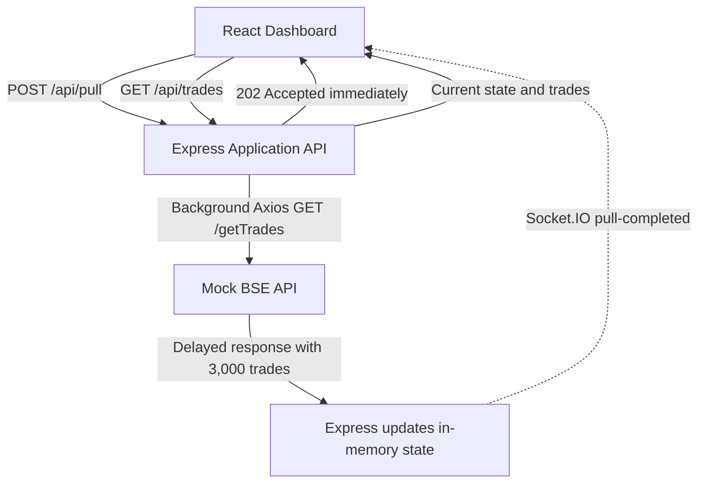

# BSE Trades Dashboard

## Project Overview

This assessment simulates pulling trade data from a slow BSE Exchange API. A full pull may take up to 15 minutes, while browser-facing HTTP connections must finish within 30 seconds. The application separates starting a pull from receiving its result: the browser gets an immediate acknowledgement, and the long-running work continues on the server.

## Architecture

The application has three simple parts:

```text
React Dashboard
      ↓
Express Application API
      ↓
Mock BSE API
```

Express also sends lightweight Socket.IO notifications back to every connected dashboard. For this assessment, the mock BSE route runs in the same Node process as the application API, but the application calls it over HTTP through Axios to keep the external-system boundary clear.

### Mock BSE API

`GET /getTrades`

- Simulates the external BSE Exchange API.
- Returns 3,000 deterministic seeded trades.
- Waits for a configurable artificial delay before responding.

### Application API

`GET /api/trades`

- Returns the last successfully pulled dataset and current pull state.
- Returns immediately and does not contact the mock BSE API.

`POST /api/pull`

- Starts the BSE pull asynchronously.
- Returns `202 Accepted` immediately.
- Returns `409 Conflict` when another pull is already active.

### Socket.IO

Socket.IO is used only for lightweight notifications:

- `pull-started`
- `pull-completed`
- `pull-failed`

Trade records are never sent through Socket.IO. After completion or failure, each dashboard reads the authoritative state through `GET /api/trades`.

## Architecture Diagram



## Why This Design

The frontend cannot safely wait on a 15-minute HTTP request because its connection may be terminated after 30 seconds. `POST /api/pull` therefore returns immediately while the server continues the work independently. The server does not clear the previous successful dataset when a new pull begins, so the dashboard remains useful throughout the import.

Socket.IO provides event-driven notification without polling. When a completion event arrives, React makes one REST request for the authoritative trade data and updates automatically without a page refresh.

This design assumes the stated 30-second timeout is a client-facing HTTP constraint and that the server-to-BSE path can support the longer operation. If the same hard limit also applies between the backend and BSE, the production integration would need to change. Axios `timeout: 0` disables an Axios client timeout; it cannot override a proxy, load balancer, or other infrastructure timeout.

## Technology Stack

Frontend:

- React
- Vite
- Axios
- Tailwind CSS
- socket.io-client

Backend:

- Node.js
- Express
- Axios
- Socket.IO
- dotenv

Storage:

- In-memory JavaScript state
- No database

## Project Structure

```text
.
├── client/
│   ├── src/
│   │   ├── App.jsx
│   │   ├── index.css
│   │   └── main.jsx
│   ├── package.json
│   └── vite.config.js
├── server/
│   ├── data/
│   │   └── seedTrades.js
│   ├── .env.example
│   ├── package.json
│   └── server.js
├── .gitignore
└── README.md
```

## Setup Instructions

Requirements:

- Node.js
- npm

### Backend

From the repository root:

```bash
cd server
npm install
```

Copy `server/.env.example` to `server/.env`. The example contains:

```env
BSE_DELAY_MS=5000
BSE_API_URL=http://127.0.0.1:3000
```

`BSE_DELAY_MS=5000` gives a five-second development delay. Use `BSE_DELAY_MS=900000` to simulate the full 15-minute scenario.

`BSE_API_URL` points to the mock BSE API. The provided setup uses backend port `3000`; if that port is changed, update both this URL and the proxy targets in `client/vite.config.js`.

Start the backend:

```bash
npm run dev
```

The backend runs at `http://localhost:3000` by default.

### Frontend

In a second terminal, from the repository root:

```bash
cd client
npm install
npm run dev
```

The dashboard runs at `http://localhost:5173`. Vite proxies `/api` and `/socket.io` requests to the backend during development.

## API Endpoints

| Method | Endpoint | Purpose | Important responses |
| --- | --- | --- | --- |
| `GET` | `/api/health` | Confirms the Express server is available. | `200 OK` |
| `GET` | `/getTrades` | Simulates the delayed external BSE response with 3,000 trades. | `200 OK` after the configured delay |
| `GET` | `/api/trades` | Returns the latest successful trades and pull state immediately. | `200 OK` |
| `POST` | `/api/pull` | Starts an asynchronous trade pull. | `202 Accepted`, or `409 Conflict` if a pull is active |

The React application only uses the application endpoints. It never calls `/getTrades` directly.

## Real-Time Flow

1. The dashboard connects to Socket.IO and loads `GET /api/trades`.
2. The user clicks **Pull Trades**.
3. Express starts the work and immediately returns `202 Accepted`.
4. Any previously pulled trades remain visible while the new pull runs.
5. The mock BSE endpoint finishes its configured delay and returns the dataset.
6. Express replaces the in-memory state with the completed dataset.
7. Socket.IO emits `pull-completed` to every connected dashboard.
8. Each dashboard calls `GET /api/trades` once.
9. React updates the table automatically.

There is no polling loop, page refresh, cron job, or scheduler.

## First Run Behavior

Storage is in memory, so a fresh server starts with no previously pulled trades. The dashboard shows an empty state and an enabled **Pull Trades** button. The user starts the first pull manually, and the table appears automatically when it completes.

## Limitations and Production Considerations

- In-memory trades and pull state are lost when Node.js restarts.
- A production implementation would use persistent storage.
- A durable job queue and background worker may be appropriate for production imports.
- Real BSE authentication, rate limits, retries, and error formats are outside this mock assessment.
- The exact behavior and scope of the stated 30-second infrastructure timeout must be confirmed in production.

## Video Walkthrough Guide

1. Briefly explain the 15-minute pull versus 30-second client timeout problem.
2. Show the architecture diagram and the separation between REST and Socket.IO.
3. Show the empty first-run dashboard.
4. Start a pull and point out the immediate `202 Accepted` behavior.
5. Show that the dashboard remains usable while the pull runs.
6. Show the trades appearing automatically when the pull completes.
7. Start another pull and show that the existing table stays visible.
8. Briefly show `POST /api/pull`, `GET /api/trades`, and the Socket.IO notifications in `server.js`.
9. Mention that the application uses no polling, page refresh, or scheduler.
